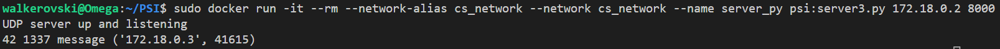
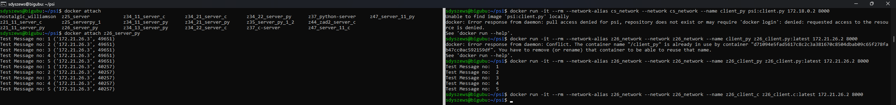
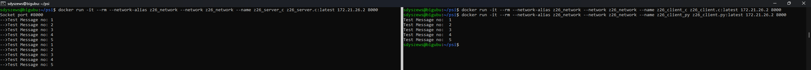
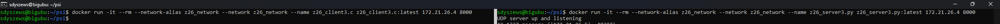
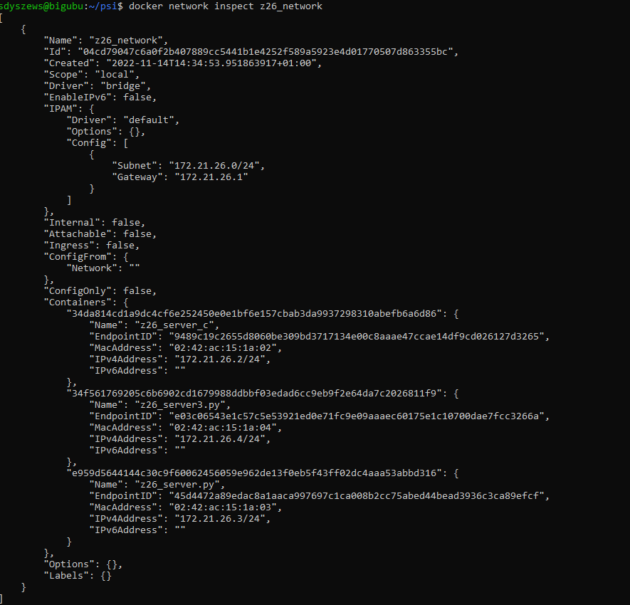

# Ćwiczenia laboratoryjnie z PSI 2022Z

Zespół nr 26

Skład:
- Szymon Dyszewski
- Karol Kasperek
- Piotr Kosmala
- Mikołaj Gutowski
## Zad 1 UDP
Klient wysyła, a serwer odbiera datagramy o stałym, niewielkim rozmiarze (rzędu kilkudziesięciu bajtów).
Datagramy mogą zawierać ustalony „na sztywno” lub generowany napis – np. „abcde….”, „bcdef...”, itd. 
Powinno być wysyłanych kilka datagramów, po czym klient powinien kończyć pracę. 
Serwer raz uruchomiony pracuje aż do zabicia procesu.

Wykonać program w dwóch wariantach: C oraz Python.

Sprawdzić i przetestować działanie „między platformowe”, tj. klient w C z serwerem Python i vice versa.

# Uruchomienie środowiska
Początkowo należy przygotować sieć do komunikacji pomiędzy kontenerami:
```sh
 sudo docker network create cs_network
```
Następnie należy uruchomić parami odpowiednie kontenery:
- Wariant python_client python_server
```sh
docker run -it --rm --network-alias cs_network --network cs_network --name client_py psi:client.py 172.18.0.2 8000
docker run -it --rm --network-alias cs_network --network cs_network --name server_py psi:server.py 172.18.0.2 8000
```
- Wariant C_client C_server
```sh
docker run -it --rm --network-alias cs_network --network cs_network --name client_c psi:client.c 172.18.0.2 8000
docker run -it --rm --network-alias cs_network --network cs_network --name server_c psi:server.c 172.18.0.2 8000
```
- Wariant python_client C_server
```sh
docker run -it --rm --network-alias cs_network --network cs_network --name client_py psi:client.py 172.18.0.2 8000
docker run -it --rm --network-alias cs_network --network cs_network --name server_c psi:server.c 172.18.0.2 8000
```
- Wariant C_client python_server
```sh
docker run -it --rm --network-alias cs_network --network cs_network --name client_c psi:client.c 172.18.0.2 8000
docker run -it --rm --network-alias cs_network --network cs_network --name server_py psi:server.py 172.18.0.2 8000
```
Wszystkie połączenia przebiegają bez zarzutu. Po 5 wysłanych datagramach procesy klientów się kończą, a serwery
oczekują na kolejne połączenia. Serwer natomiast otrzymuje datagramy i wypisuje je w konsoli.

## Zad 1.3

Na bazie wersji zadania 1.1 napisać w C klienta, który wysyła datagram zawierający strukturę
zawierającą kilka liczb oraz napis: „struct { int32_t a; int16_t b; char c[16];}”. Serwer napisany w
Pythonie powinien odebrać i dokonać poprawnego „odpakowania” tej struktury i wydrukowania jej
pól. (Można też napisać klienta w Pythonie a serwer w C)

Wskazówka: wykorzystać moduły Python-a: struct i io.

Do zastanowienia, dlaczego warto stosować w programowaniu sieciowym typy określone w
standardzie C99 (np. int32_t) zamiast typy proste (int)?

Początkowo należy przygotować sieć do komunikacji pomiędzy kontenerami:
```sh
 sudo docker network create cs_network
```
Następnie należy uruchomić odpowiednie kontenery:
- Wybraliśmy wariant C_client python_server
```sh
docker run -it --rm --network-alias cs_network --network cs_network --name client_c psi:client3.c 172.18.0.2 8000
docker run -it --rm --network-alias cs_network --network cs_network --name server_py psi:server3.py 172.18.0.2 8000
```
Serwer otrzymał message oraz go rozpakował:

Wszystkie zadania wykonaliśmy na maszynie lokalnej, a rozwiązania zostały dołączone i przetestowane na serwerze bigubu.
## Serwer bigubu
- Wariant python_client python_server
```sh
docker run -it --rm --network-alias z26_network --network z26_network --name z26_client.py z26_client3.py 172.21.26.4 8000
docker run -it --rm --network-alias z26_network --network z26_network --name z26_server.py z26_server3.py 172.21.26.4 8000
```
Reszta wariantów analogicznie.
- Wariant python_server z kolejno client.py + client.c


- Wariant c_server z kolejno client.c + client.py


- Wariant py_server z client.c (zad3)


- Koncowy stan sieci z 3 działającymi serwerami na kontenerach

