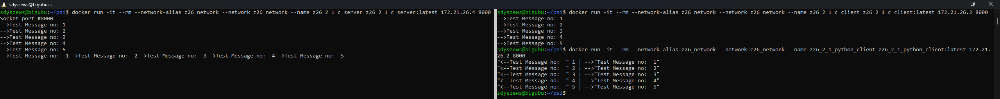
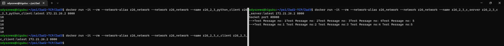
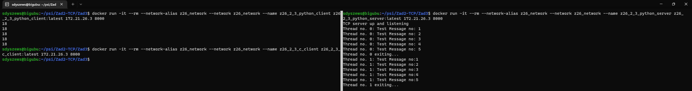

# Ćwiczenia laboratoryjnie z PSI 2022Z

Zespół nr 26

Skład:
- Szymon Dyszewski
- Karol Kasperek
- Piotr Kosmala
- Mikołaj Gutowski
## Zad 1 TCP
Klient wysyła, serwer odbiera porcje danych o stałym, niewielkim rozmiarze (rzędu kilkudziesięciu
bajtów). Mogą one zawierać ustalony „na sztywno” lub generowany napis – np. „abcde….”,
„bcdef...”, itd. Po wysłaniu danych klient powinien kończyć pracę. Serwer raz uruchomiony pracuje
aż do zabicia procesu.

Wykonać program w dwóch wariantach: C oraz Python.

Sprawdzić i przetestować działanie „między platformowe”, tj. klient w C z serwerem Python i vice
versa
# Uruchomienie środowiska
Początkowo należy przygotować sieć do komunikacji pomiędzy kontenerami:
```sh
 sudo docker network create cs_network
```
Następnie należy uruchomić parami odpowiednie kontenery:
- Wariant python_client python_server
```sh
docker run -it --rm --network-alias cs_network --network cs_network --name z26_2_1_python_server z26_2_1_python_server:latest
docker run -it --rm --network-alias cs_network --network cs_network --name z26_2_1_python_client z26_2_1_python_client:latest 172.18.0.2 8000
```
- Wariant C_client C_server
```sh
docker run -it --rm --network-alias cs_network --network cs_network --name z26_2_1_c_server z26_2_1_c_server:latest 
docker run -it --rm --network-alias cs_network --network cs_network --name z26_2_1_c_client z26_2_1_c_client:latest 172.18.0.2 8000
```
- Wariant python_client C_server
```sh
docker run -it --rm --network-alias cs_network --network cs_network --name z26_2_1_c_server z26_2_1_c_server:latest 
docker run -it --rm --network-alias cs_network --network cs_network --name z26_2_1_python_client z26_2_1_python_client:latest 172.18.0.2 8000
```
- Wariant C_client python_server
```sh
docker run -it --rm --network-alias cs_network --network cs_network --name z26_2_1_python_server z26_2_1_python_server:latest
docker run -it --rm --network-alias cs_network --network cs_network --name z26_2_1_c_client z26_2_1_c_client:latest 172.18.0.2 8000
```
Wszystkie połączenia przebiegają bez zarzutu. Po 5 wysłanych datagramach procesy klientów się kończą, a serwery
oczekują na kolejne połączenia. Serwer natomiast otrzymuje datagramy i wypisuje je w konsoli.

## Serwer bigubu

- Serwer C


- Serwer Python


## Zad 2

Zmodyfikować program serwera tak, aby bufor odbiorczy był mniejszy od wysyłanej jednorazowo
przez klienta porcji danych. W wariancie Python wykonać eksperymenty z funkcjami send() i
sendall(). Jak powinien zostać zmodyfikowany program klienta i serwera, aby poprawnie obsłużyć
komunikację? (uwaga – w zależności od wykonanej implementacji programu z punktu 2.1 mogą, ale
nie muszą poprawnie obsługiwać wariant transmisji z punktu 2.2)

Napisane przez nas programy nie wymagały modyfikacji, poza odpowiednim zmniejszeniem bufora serwera na bufor mniejszy  od rozmiaru wysyłanej wiadomości. Mimo to w wersji C serwera zrekonstruowaliśmy wiadomości otrzymywane w częściach do oryginalnej wiadomości klienta. W pythonie tego nie zrobiliśmy - można więć zaobserwować fragmentowanie wysyłanej wiadomości.

Staraliśmy się uzyskać jakąkolwiek różnicę w działaniu funkcji send() i sendall(), nie zaobserwowano żadnych różnic. (wysyłaliśmy wiadomości rzędu 50KB na bufor o rozmiarze 8B niestety nasz program radził sobie wyśmienicie)

## Serwer bigubu

- Serwer C


- Serwer Python


## Zad 5

Na bazie wersji 2.1 – 2.2 zmodyfikować serwer tak, aby miał konstrukcję współbieżną, tj.
obsługiwał każdego klienta w osobnym procesie. Przy czym:

• Dla C. Należy posłużyć się funkcjami fork() oraz (obowiązkowo) wait().

• Dla Pythona należy posłużyć się wątkami, do wyboru: wariant podstawowy lub skorzystanie
z ThreadPoolExecutor.

Zgodnie z poleceniem zrównoleglono obsługę połączeń między klientem a serwerem. W przypadku serwera w C za pomocą funkcji fork() oraz wait(). W przypadku serwera w Py za pomocą wariantu podstawowego Thread().

- Wariant C_server
```sh
docker run -it --rm --network-alias cs_network --network cs_network --name z26_2_3_c_server z26_2_3_c_server:latest 
docker run -it --rm --network-alias cs_network --network cs_network --name z26_2_3_c_client z26_2_3_c_client:latest 172.21.26.2 8000
docker run -it --rm --network-alias cs_network --network cs_network --name z26_2_3_python_client z26_2_3_python_client:latest 172.21.26.2 8000
```
- Wariant Py_server
```sh
docker run -it --rm --network-alias cs_network --network cs_network --name z26_2_3_python_server z26_2_3_python_server:latest 
docker run -it --rm --network-alias cs_network --network cs_network --name z26_2_3_c_client z26_2_3_c_client:latest 172.21.26.3 8000
docker run -it --rm --network-alias cs_network --network cs_network --name z26_2_3_python_client z26_2_3_python_client:latest 172.21.26.3 8000
```
## Serwer bigubu

- Serwer C


- Serwer Python
